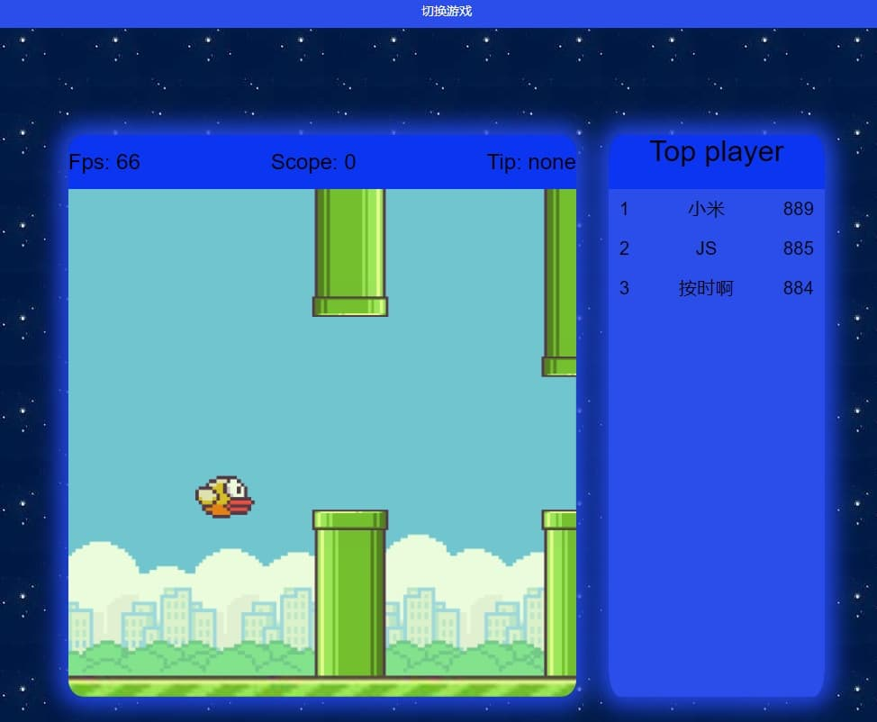
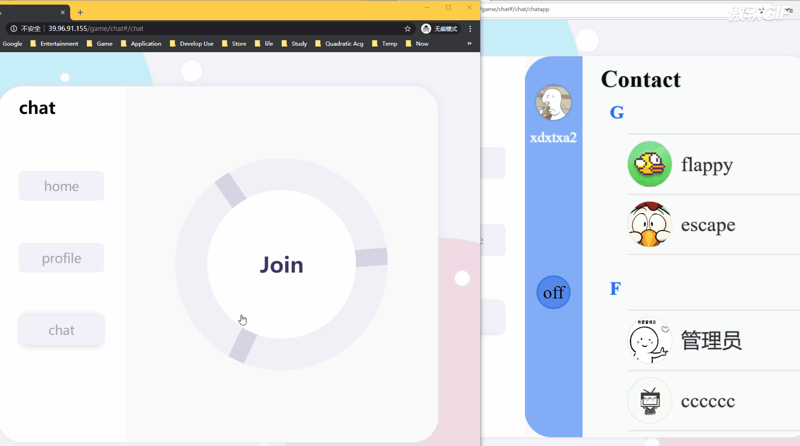

# gamebbs


## Preview

[点击直达展示网站](http://39.96.91.155)

[备用展示服务器](http://106.15.198.234)


> **主页: /game**

> pc

> 

> phone

> 


> **游玩页: /game/play**

> pc

> 

> phone

> 


> **聊天页: /game/chat#/home**

> pc

> 

> chat gif

> 

## Requirements

* **npm   6.0+**

* **node   v10.0+**


## Installation-1 (express ejs)

### framework

1. **[layui 2.5+](https://www.layui.com/)**
2. **[WeAdmin 2019.6](https://gitee.com/lovetime/WeAdmin)**
3. **[vue.js 2.x](https://cn.vuejs.org/)**


### dependencies

> **npm install**

```npm
  "dependencies": {
    "cookie-parser": "~1.4.4",
    "debug": "~2.6.9",
    "ejs": "~2.6.1",
    "express": "~4.16.1",
    "express-session": "^1.17.1",
    "http-errors": "~1.6.3",
    "morgan": "~1.9.1",
    "multer": "^1.4.2",
    "mysql": "^2.18.1",
    "socket.io": "^2.3.0"
  }
```


## Installation-2  (vue-cli 待上传)

### vue  create
```bash
(* ) Router
(* ) Vuex
(* ) CSS Pre-processors --> less
( ) Linter / Formatter [vscode 插件代替]
history  no [对该地址始终返回同一个HTML应该可以用history模式]
```


### dev dependencies

> **npm install**

```npm
  "devDependencies": {
    "animate.css": "^4.1.0",
    "axios": "^0.19.2",
    "core-js": "^3.6.5",
    "echarts": "^4.8.0",
    "socket.io-client": "^2.3.0",
    "vant": "^2.9.4",
    "vue": "^2.6.11",
    "vue-router": "^3.2.0",
    "vuex": "^3.4.0"
  },
```


## Sql table
```mysql
  DATABASE `gamebbs` CHARACTER SET 'utf8mb4' COLLATE 'utf8mb4_general_ci'
  |	  
  |	  -- 用户信息
  ├── TABLE `gamebbs`.`user`
  |   ├── `id` int(0) NOT NULL AUTO_INCREMENT,
  |   ├── `username` varchar(255) NOT NULL,
  |   ├── `nickname` varchar(255) NULL,
  |   ├── `password` varchar(255) NULL,
  |   ├── `email` varchar(255) NULL,
  |   ├── `phone` varchar(255) NULL,
  |   ├── `headimg` varchar(255) NULL,
  |   ├── `roleid` int(0) NOT NULL DEFAULT 0,
  |   ├── `level` int(0) NOT NULL DEFAULT 0,
  |   ├── `token` varchar(255) NULL,
  |   ├── `socketid` varchar(255) NULL,
  |   ├── `isonline` int(0) NOT NULL DEFAULT 0,
  |   ├── `registerTime` datetime NULL,
  |   ├── `loginTime` datetime NULL,
  |   ├── `deleteFlag` int(0) NOT NULL DEFAULT 0,
  |   └── PRIMARY KEY (`id`, `username`)
  |   
  |   -- 用户关联的游戏分数 TODO: 增加一张game表, 记录 id,gameName， 这里结构改为 id,userid,gameid,gameScore
  ├── TABLE `gamebbs`.`score` 
  |   ├── `id` int(0) NOT NULL AUTO_INCREMENT,
  |   ├── `userid` int(0) NULL,
  |   ├── `escape` bigint(0) NOT NULL DEFAULT 0,
  |   ├── `flappyBird` bigint(0) NOT NULL DEFAULT 0,
  |   └── PRIMARY KEY (`id`)
  |   
  |   -- 角色信息 初始化4个角色 超级管理员、用户管理员、权限管理员、普通成员
  ├── TABLE `gamebbs`.`role` 
  |   ├── `id` int(0) NOT NULL AUTO_INCREMENT,
  |   ├── `rolename` varchar(255) NULL,
  |   ├── `brief` varchar(255) NULL,
  |   └── PRIMARY KEY (`id`)
  |   
  |   -- 权限信息 初始化3条权限 (用户管理, /admin/users)、(权限管理, /admin/auths)、(无权限、null)
  ├── TABLE `gamebbs`.`auth` 
  |   ├── `id` int(0) NOT NULL AUTO_INCREMENT,
  |   ├── `authname` varchar(255) NULL,
  |   ├── `authurl` varchar(255) NULL,
  |   └── PRIMARY KEY (`id`)
  |   
  |   -- 权限与角色的关系表 初始化4个角色对应的权限id 
  ├── TABLE `gamebbs`.`role_auth` 
  |   ├── `id` int(0) NOT NULL AUTO_INCREMENT,
  |   ├── `roleid` int(0) NULL,
  |   ├── `authid` int(0) NULL,
  |   └── PRIMARY KEY (`id`)
  |
  |   -- 聊天记录
  └── TABLE `gamebbs`.`chat` 
      ├── `id` int(0) NOT NULL AUTO_INCREMENT,
      ├── `sender` int(0) NULL,
      ├── `receiver` int(0) NULL,
      ├── `message` varchar(255) CHARACTER SET utf8mb4 COLLATE utf8mb4_general_ci NULL DEFAULT NULL,
      ├── `time` bigint(0) NULL DEFAULT NULL,
      ├── `isread` int(0) NULL,
      └── PRIMARY KEY (`id`)
```


## Server config (ubuntu 16 lts)

### nginx & supervisor

> **nginx**

```bash
# 从nginx.conf的默认配置来看还支持两种外部的配置
# include /etc/nginx/conf.d/*.conf;
# include /etc/nginx/sites-enabled/*;

ln -s /var/www/gamebbs/gamebbs.nginx  /etc/nginx/sites-enabled/gamebbs
```

> **gamebbs.nginx **

```bash
server {
	# 可添加域名
    listen 80;
    # gamebbs express
    location / {
        proxy_pass http://127.0.0.1:30000;
    }
    # gamebbs socket.io
    location /socket.io/ {
        proxy_pass http://127.0.0.1:30000;
        proxy_http_version 1.1;
        proxy_set_header Upgrade $http_upgrade;
        proxy_set_header Connection "upgrade";
    }
}
```

> **supervisor(非npm的supervisor)**

```bash
# 格式需要*.conf
ln -s /var/www/gamebbs/gamebbs.conf /etc/supervisor/conf.d/gamebbs.conf
```

```bash
[program:gamebbs]
command=node bin/www
directory=/var/www/gamebbs
autostart=true
autorestart=true
redirect_stderr=true
```

* **有概率supervisorctl  start gamebbs 找不到gamebbs的情况**
* **service supervisor restart 一下**